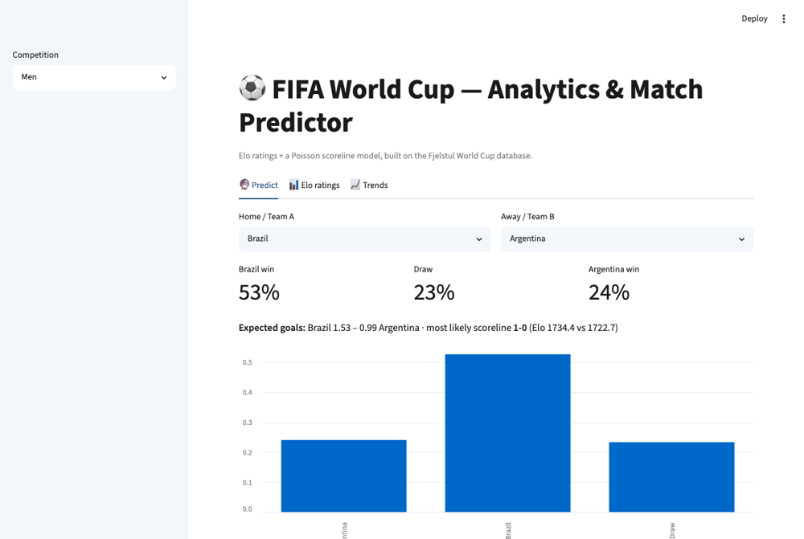
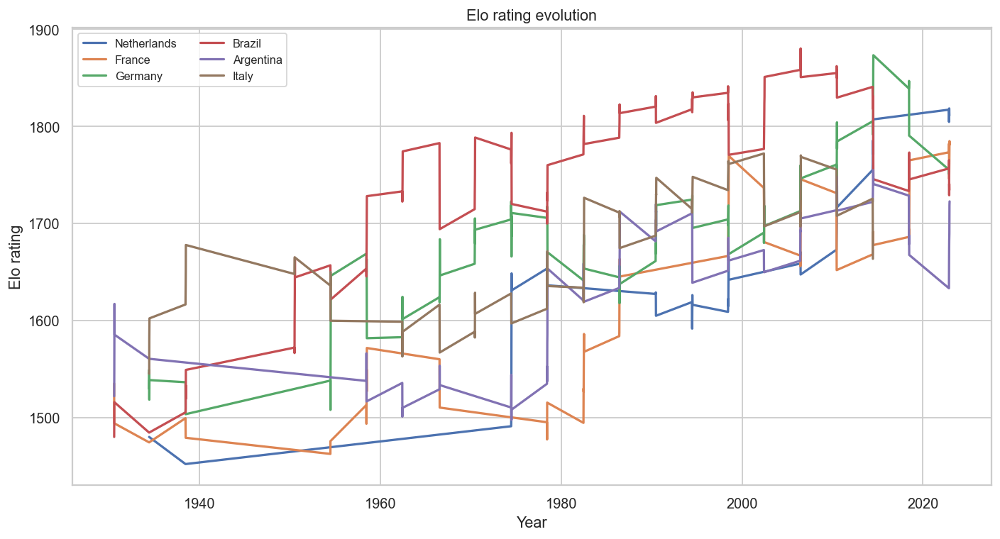
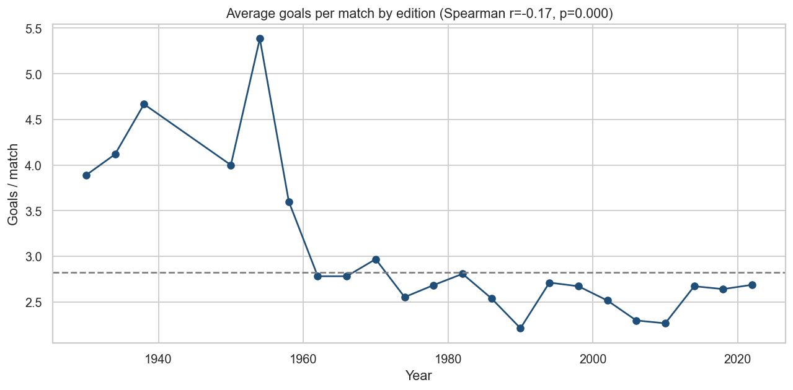
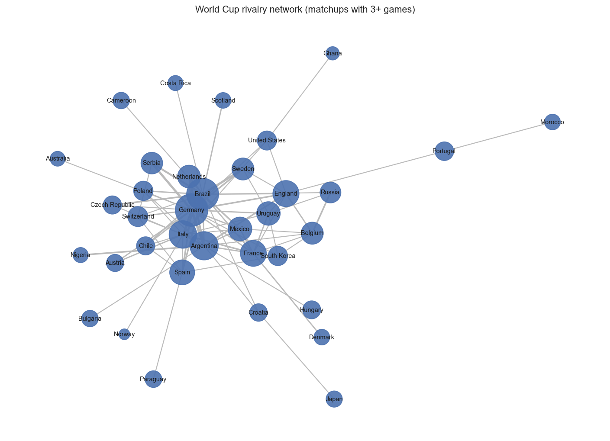
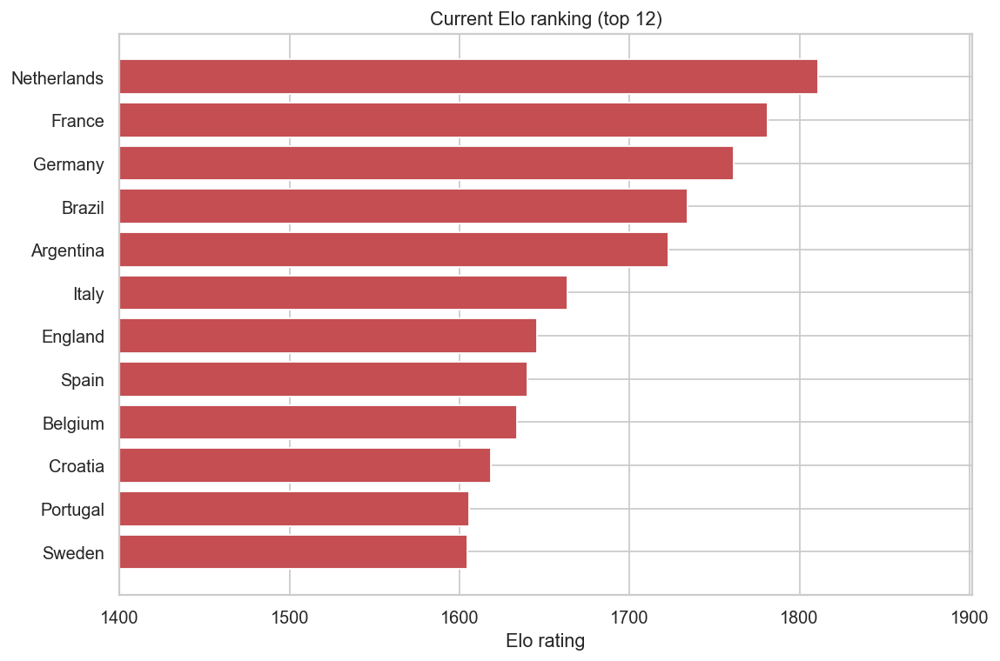

# ⚽ FIFA World Cup — Analytics & Match Prediction

[](https://github.com/gabrielreisz/fifa-world-cup-analytics/actions/workflows/ci.yml)
[](assets/coverage.svg)
[](https://www.python.org/)
[](LICENSE)
[](https://github.com/astral-sh/ruff)
[](https://gabrielreisz-fifa-world-cup-analytics-appstreamlit-app-iynv35.streamlit.app)

An end-to-end data-science project on the men's & women's FIFA World Cup: from raw data
ingestion to **Elo ratings**, **statistical inference**, **machine-learning match
predictions**, an **interactive dashboard** and a **REST API**.

It started as a university assignment ([`notebooks/academic/`](notebooks/academic/)) and was
re-engineered into an installable, tested Python package.

<p align="center">
  
</p>

> **Resumo (PT-BR):** Projeto completo de ciência de dados sobre as Copas do Mundo. Inclui
> um pacote Python instalável (`worldcup`) com pipeline de dados, ratings de Elo calculados
> cronologicamente, testes estatísticos, modelos de previsão de partidas (Elo + Poisson),
> testes automatizados, CI, um dashboard interativo (Streamlit) e uma API (FastAPI). O
> trabalho acadêmico original está preservado em `notebooks/academic/`.

---

## 🌐 Live demo

The dashboard is ready to run on **Streamlit Community Cloud** (free). Click the
**Open in Streamlit** badge above (or [this link](https://share.streamlit.io/deploy?repository=gabrielreisz%2Ffifa-world-cup-analytics&branch=main&mainModule=app%2Fstreamlit_app.py)),
sign in with GitHub and confirm — main file `app/streamlit_app.py`.

> **▶️ Live app:** <https://gabrielreisz-fifa-world-cup-analytics-appstreamlit-app-iynv35.streamlit.app>

To deploy your own copy, use [this link](https://share.streamlit.io/deploy?repository=gabrielreisz%2Ffifa-world-cup-analytics&branch=main&mainModule=app%2Fstreamlit_app.py).

Locally:

```bash
pip install -e ".[app]"
streamlit run app/streamlit_app.py
```

---

## ✨ Highlights

- **Reproducible data pipeline** — one command downloads & caches the [Fjelstul World Cup
  database](https://github.com/jfjelstul/worldcup).
- **Chronological Elo engine** — margin-weighted ratings computed match-by-match, usable as a
  *leak-free* feature for prediction.
- **Two prediction models** — a calibrated 1X2 outcome model (logistic regression on the Elo
  gap) and a Poisson scoreline model (expected goals + full score matrix).
- **Dixon-Coles model** — full bivariate-Poisson MLE with per-team attack/defence, home
  advantage, the low-score correction (`rho`) and optional time decay.
- **Walk-forward back-test** — rolling-origin evaluation across editions with accuracy,
  log-loss, Brier score and calibration curves.
- **Honest evaluation** — strict temporal back-test (train pre-2014, test 2014+) against a
  baseline.
- **Statistical analyses** — goal-scoring trends, host advantage (Welch t-test), the 0-0
  Poisson paradox, biggest historical upsets, rivalry networks.
- **Ships an app** — Streamlit dashboard **and** a FastAPI service.
- **Engineering** — `src/` layout, `pytest` suite, `ruff` linting, GitHub Actions CI, typed
  CLI (`worldcup ...`).

## 📈 Selected results (men's World Cup)

| Question | Method | Finding |
|---|---|---|
| Has football become more defensive? | Spearman(year, goals) | **r = −0.17, p < 0.001** — yes, scoring declined |
| Does the host change the game? | Welch t-test | **p = 0.82** — no significant effect on goals |
| Are 0-0 draws "rare"? | Poisson(λ) vs reality | 6.0% predicted vs **8.1% actual** — football is a bit more defensive than random |
| Biggest upset ever | pre-match Elo gap | **South Korea 2-0 Germany (2018)**, ~470 Elo gap |
| Match-outcome model | temporal back-test | **47% accuracy / 1.07 log-loss** vs 43% / 1.12 baseline |

<p align="center">
  
  <br/>
  
  
</p>

## 🚀 Quickstart

```bash
git clone https://github.com/gabrielreisz/fifa-world-cup-analytics.git
cd fifa-world-cup-analytics
pip install -e ".[app,dev]"

worldcup build-data          # download & cache the datasets
worldcup report              # headline findings + figures -> reports/figures/
worldcup evaluate            # temporal back-test of the outcome model
worldcup predict Brazil Argentina
worldcup backtest            # walk-forward back-test across editions
worldcup strengths           # Dixon-Coles attack/defence ratings
```

Example:

```
Brazil (Elo 1734) vs Argentina (Elo 1723)
  P(Brazil win) = 52.6% | P(draw) = 23.3% | P(Argentina win) = 24.0%
  expected goals: 1.53 - 0.99 (most likely 1-0)
```

> 📓 New here? Start with the guided notebook **[`notebooks/01_overview.ipynb`](notebooks/01_overview.ipynb)**.

### Use it as a library

```python
from worldcup import features, models

matches = features.build_matches("men")
predictor = models.MatchPredictor.train(matches)
predictor.predict("France", "Brazil")
```

### Run the app

```bash
streamlit run app/streamlit_app.py        # interactive dashboard
uvicorn app.api:app --reload              # REST API at /docs
```

## 🗂️ Project structure

```
fifa-world-cup-analytics/
├── src/worldcup/            # installable package
│   ├── config.py            # paths, data sources, domain constants
│   ├── data.py              # download / cache / load raw tables
│   ├── features.py          # match & team-match tables, team strengths
│   ├── elo.py               # chronological Elo rating engine
│   ├── analysis.py          # descriptive + inferential analyses
│   ├── models.py            # outcome + Poisson scoreline models, back-test
│   ├── viz.py               # figure generation
│   └── cli.py               # `worldcup` command-line interface
├── app/                     # Streamlit dashboard + FastAPI service
├── tests/                   # pytest suite (no network needed)
├── notebooks/
│   ├── 01_overview.ipynb    # guided tour of the package (start here)
│   └── academic/            # the original university deliverable (preserved)
├── reports/figures/         # generated figures (git-ignored)
└── .github/workflows/ci.yml # lint + tests on every push
```

## 🔬 Methodology notes

- **Elo** starts every team at 1500; updates are scaled by the goal margin and applied in
  date order, so a team's rating *before* a match never depends on its result — this is what
  makes it a valid predictive feature.
- **Outcome model**: multinomial logistic regression on the Elo difference, producing
  calibrated `P(home win / draw / away win)`.
- **Score model**: a Poisson regression of goals on `(team Elo, opponent Elo, home flag)`;
  combining the two teams' expected goals gives a scoreline probability matrix.
- Historical/split nations (West Germany, Soviet Union, Yugoslavia, …) are mapped to a modern
  entity so long-run analyses aren't fragmented — see `config.TEAM_ALIASES`.

## 🧪 Development

```bash
make test     # pytest -m "not integration"
make lint     # ruff
make report   # regenerate figures
```

## 📚 Data & license

Data: **Fjelstul World Cup Database** (CC-BY-4.0). Code: **MIT** — see [LICENSE](LICENSE).

## 👥 Authors

Ana Luiza Gonçalves Campos · Gabriel Costa Reis
